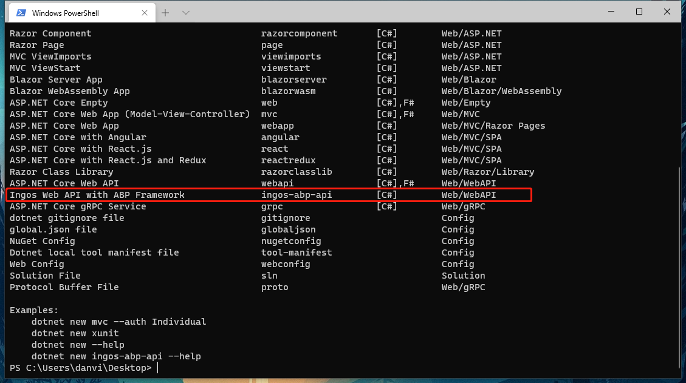

# ingos-abp-api-template
a simplified version of abp vnext web api template with integrated dapr runtime


## Architecture


## Get Started

### 1、Install

Similar to installing other dotnet tools, you can use `dotnet new`  command to install this template on your computer.

```sh
-- it will install this template in your computer
dotnet new -i Ingos.Abp.Templates
```

Also, if you want to install the specified version, you need to add the version no after the name of the template

```sh
-- it will install the 1.0.0 version of this template 
dotnet new -i Ingos.Abp.Templates::1.0.0
```

When you see the following picture, it means that the template has been installed successfully




### 2、How to use

After you have installed this template, you can use dotnet cli to create a new project based on this template, just like the following shell.

```sh
-- it will create a project which named Sample 
dotnet new ingos-abp-api -n Sample
```

If you want to learn more about this template, you can enter the following shell script to get help information.

```shell
dotnet new ingos-abp-api --help
```

Or you can using the latest Visual Studio to create the project, but please note that this cannot modify the default database option. The default database is MySQL.


When you create a new project, you need to change the connection string first


### 3、Uninstall

```shell
-- it will uninstall this template from your computer
dotnet new -u Ingos.Abp.Templates
```

